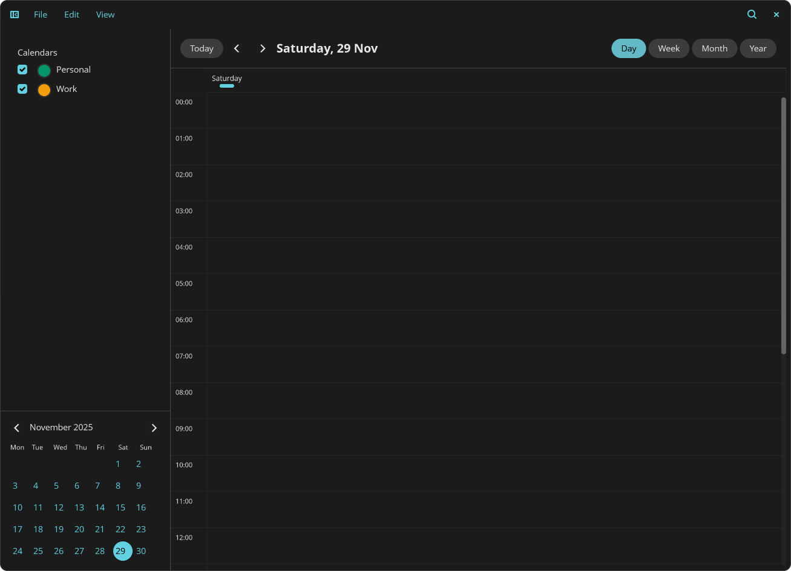
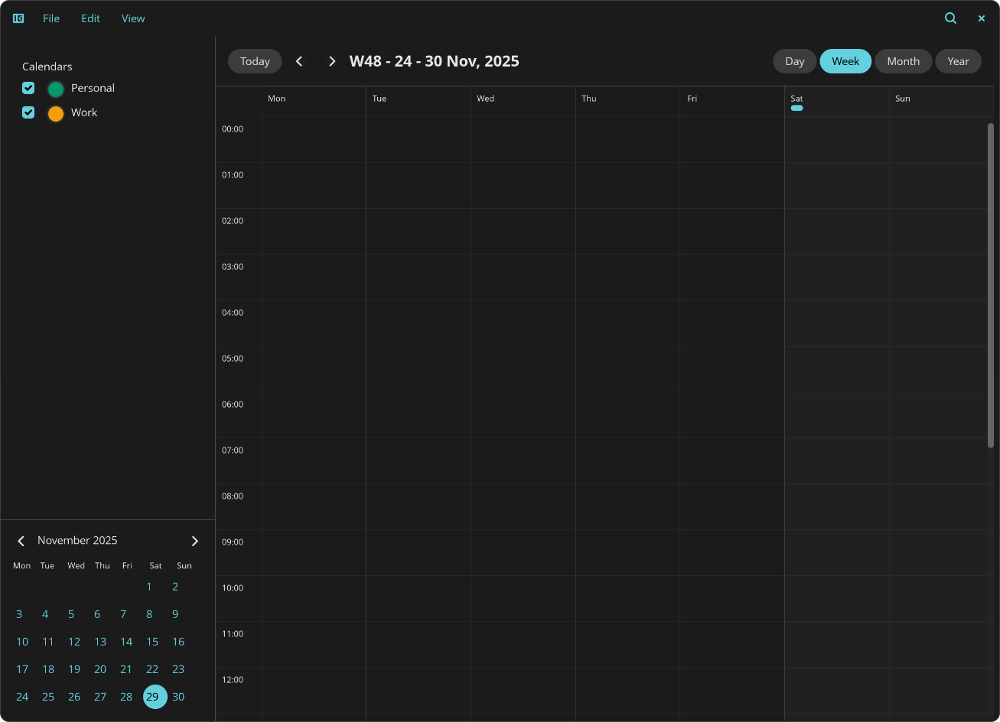
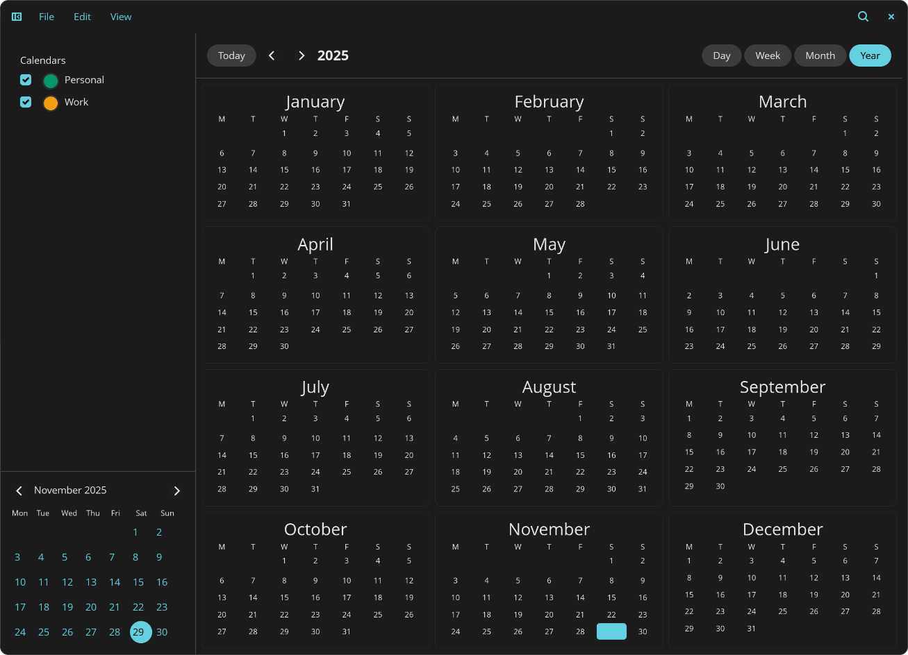

# Sol - a Calendar for the COSMIC Desktop








> ⚠️ **WORK IN PROGRESS** - This project is in early development and is **not ready for production use**. Many features are incomplete or missing. Use at your own risk!

A modern calendar application built with [libcosmic](https://github.com/pop-os/libcosmic), featuring CalDAV support for seamless calendar synchronization.

## About

Sol is a native calendar application designed for the COSMIC desktop environment. Built using libcosmic's widget system, it provides a clean, intuitive interface inspired by Apple Calendar's design while following COSMIC's design language and responsive layout patterns.

The application will support CalDAV protocol for synchronizing events with calendar servers like Nextcloud, Radicale, and other standard CalDAV-compatible services.

## Current Status

This project is in **active development**. The UI foundation is in place, but core calendar functionality is still being implemented.

### ✅ Implemented Features

- Apple Calendar-inspired layout with responsive left sidebar
- Mini calendar in sidebar for quick date navigation
- Month view with calendar grid
- Day selection with visual feedback (outlined today, filled selection)
- Square day cells with 4px rounded corners (theme-independent)
- Instant responsive UI that adapts to window size
- Sidebar overlay mode for small screens (COSMIC Files-style)
- Toolbar with view switcher (Day/Week/Month)
- Navigation controls (Previous/Next/Today buttons)
- COSMIC-style menu bar (File, Edit, View, Help)

### 🚧 Work In Progress

- [ ] Event creation, editing, and deletion
- [ ] Week and Day view implementations
- [ ] CalDAV server configuration UI
- [ ] Active CalDAV synchronization
- [ ] Event display in calendar grid
- [ ] Multiple calendar support
- [ ] Event notifications
- [ ] Recurring events
- [ ] Background sync

## Building

### Prerequisites

- Rust (latest stable version)
- libcosmic dependencies (automatically fetched from git)

### Compile

```bash
cargo build --release
```

### Run

```bash
cargo run --release
```

## Architecture

The application is structured into three main modules:

- **`src/main.rs`**: Core application logic and UI rendering using libcosmic
- **`src/caldav.rs`**: CalDAV client implementation for server synchronization
- **`src/storage.rs`**: Local storage management for event caching

## Technology Stack

- **[libcosmic](https://github.com/pop-os/libcosmic)**: Modern UI framework for COSMIC desktop built on iced
- **chrono**: Date and time handling
- **icalendar**: iCalendar format parsing and generation
- **reqwest**: HTTP client for CalDAV operations
- **serde**: Serialization/deserialization
- **dirs**: Platform-specific directory handling

## Planned CalDAV Support

The application will support full CalDAV protocol integration:

- Connect to any CalDAV-compatible server (Nextcloud, Radicale, etc.)
- Synchronize events bidirectionally
- Local event caching for offline access
- Support for multiple calendar accounts

### Planned CalDAV Configuration

Users will be able to configure:
1. CalDAV server URL
2. Username and password/app-specific password
3. Which calendars to sync
4. Sync interval

## Design Philosophy

- **Native COSMIC integration**: Uses libcosmic for native look and feel
- **Responsive design**: Adapts to different window sizes with instant transitions
- **Theme-independent styling**: Critical UI elements maintain consistent appearance
- **Offline-first**: Local storage with server sync
- **Privacy-focused**: Events stored locally by default

## Project Structure

```
cosmic-calendar/
├── src/
│   ├── main.rs         # Main application and UI
│   ├── caldav.rs       # CalDAV client implementation
│   └── storage.rs      # Local event storage
├── images/             # Screenshots and assets
├── Cargo.toml          # Dependencies
└── README.md           # This file
```

## Contributing

Contributions are welcome! However, please note that this project is in early development and the architecture may change significantly. Feel free to:

- Report bugs and issues
- Suggest features
- Submit pull requests
- Improve documentation

## License

This project is licensed under the GNU General Public License v3.0 (GPLv3). See the [LICENSE](LICENSE) file for details.

## Disclaimer

**This software is NOT ready for production use.** Features are incomplete, bugs are expected, and data loss may occur. Do not rely on this application for important calendar events at this time.
